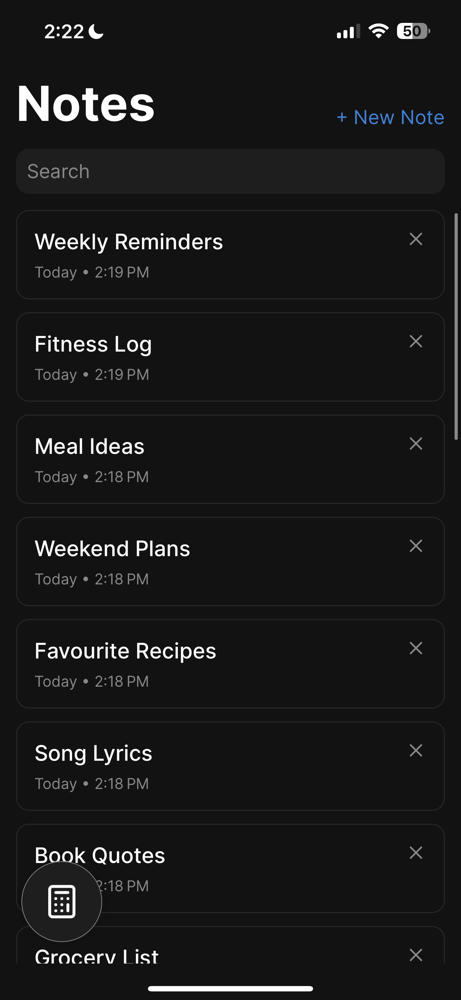
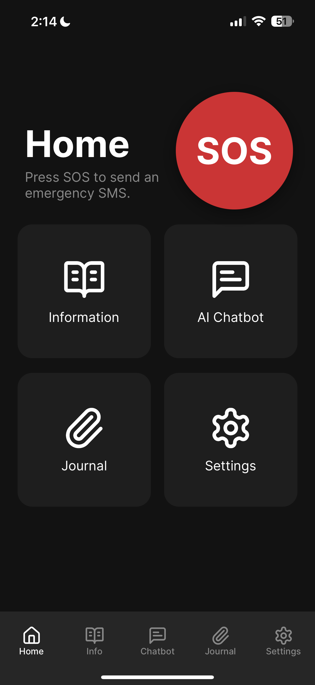
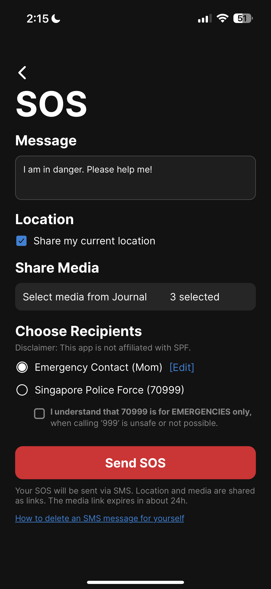
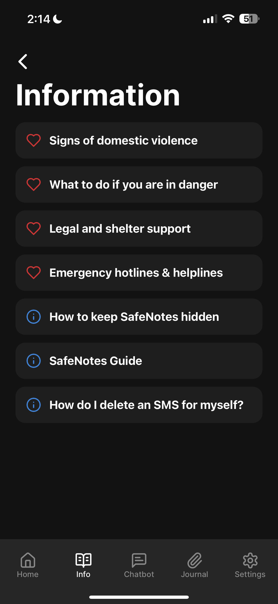
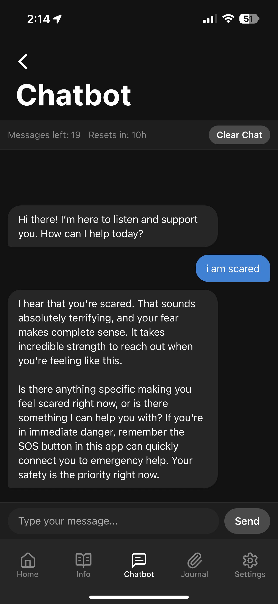
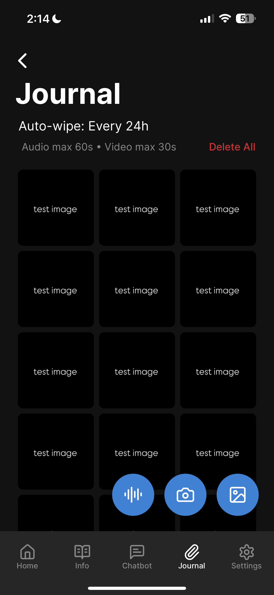
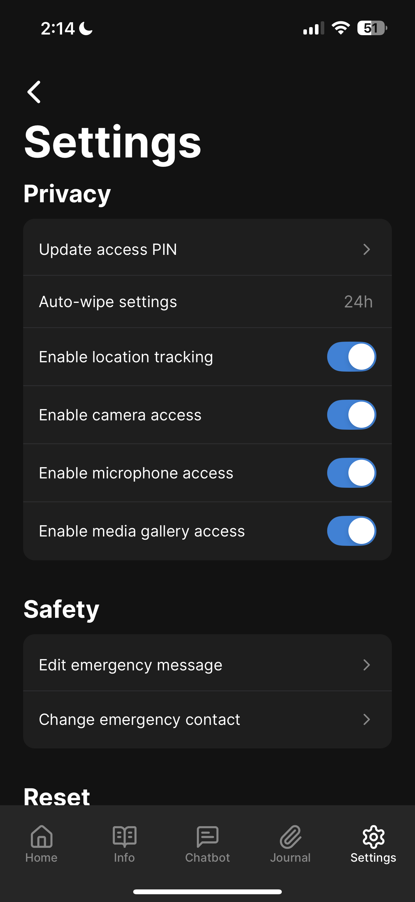
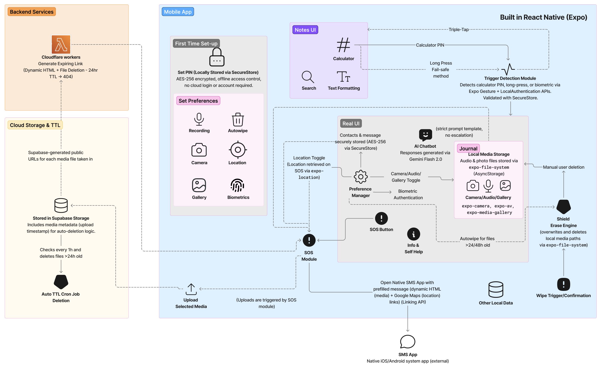

# SafeNotes

SafeNotes is a disguised crisis management and reporting app for domestic violence and abuse victims in Singapore. It begins as a fully functional notes app with utilities, and transforms into a powerful support tool, hidden behind a calculator and 4-digit PIN.

## ⭐ Key Features

### Disguised Interface

- Rich text notes with formatting
- Built-in calculator with standard functionality
- Search tool to highlight text

### Secure Unlock

- Enter a secret 4-digit PIN into the calculator and press = to reveal the real UI
- Optional biometric failsafe via long-press
- Triple tap anywhere in real UI to return to disguise

### SOS Mode

- Pre-filled emergency SMS with optional location + media links
- Media is uploaded (via Supabase) and expires automatically in 24h
- Quick-send to a trusted contact
- Designed for silent crisis help

### Info & Support

- Educational InfoHub
- AI-powered emotional support chatbot (Gemini Flash 2.0)
- Media Journal (photos, audio, video — locally stored)

### Privacy-Centric Settings

- Toggle location, camera, mic, and gallery access
- Update emergency message/contact and PIN
- “Reset to onboarding” wipes all data (except chatbot limits)

## ⭐ Screenshots

### Disguise Mode

<table>
  <tr>
    <td align="center">
      <strong>Notes</strong> 
      
    </td>
    <td align="center">
      <strong>Calculator</strong> 
      
    </td>
  </tr>
</table>

---

### Real Interface

<table>
  <tr>
    <td align="center">
      <strong>Home</strong> 
      
    </td>
    <td align="center">
      <strong>SOS</strong> 
      
    </td>
    <td align="center">
      <strong>InfoHub</strong> 
      
    </td>
  </tr>
  <tr>
    <td align="center">
      <strong>Chatbot</strong> 
      
    </td>
    <td align="center">
      <strong>Journal</strong> 
      
    </td>
    <td align="center">
      <strong>Settings</strong> 
      
    </td>
  </tr>
</table>

## ⭐ Tech Stack

- **React Native** (via Expo)
- **Gemini Flash 2.0**: AI-powered, template-prompted emotional support chatbot
- **SecureStore**: AES256-encrypted local storage (for PIN, settings, emergency data)
- **AsyncStorage**: Stores chatbot message history and journal media
- **Supabase**: Cloud storage for SOS media uploads and metadata with cron-based expiry
- **Cloudflare Workers**: Generates dynamic HTML pages to display up to 5 media items

## ⭐ Architecture

## ⭐ Limitations & Notes

- No user authentication (for safety & privacy)
- Media shared via dynamic links (no MMS support in Expo)
- SOS to police only to be used in life-threatening situations, with compulsory location-sharing

## ⭐ Team

This project was developed as part of CODE_EXP 2025 by a team of four:  
**Chua Chloe**: Core app architecture, SOS system, media journal, and overall integration  
**Justin Goh**: Onboarding flow and user preference handling  
**Chew Wei Jie**: InfoHub content and screen development  
**Cheong Kang Jie**: AI chatbot implementation using Gemini Flash 2.0
